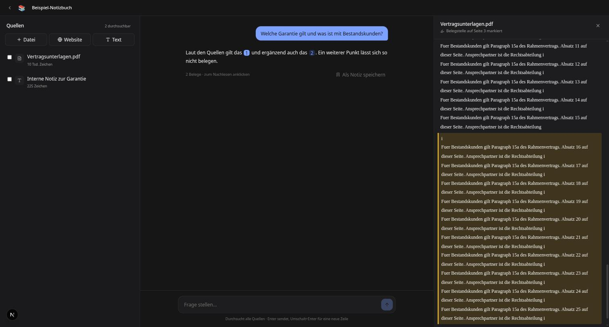

# NotebookLM-Klon

Quellen hochladen, mit ihnen chatten, und jede Aussage über einen Beleg zurück in die Quelle verfolgen.



---

## Live ausprobieren

**→ [notebook.dmn-software.com](https://notebook.dmn-software.com)**

|              |                       |
| ------------ | --------------------- |
| **E-Mail**   | `demo@notebook.local` |
| **Passwort** | `demo-belege-2026`    |

Der Zugang hat ein vorbereitetes Notizbuch mit zwei fertig verarbeiteten Quellen. Es muss also nichts hochgeladen werden, bevor etwas zu sehen ist.

Er ist schreibgeschützt: Chat, Belege und Studio laufen, Hochladen, Umbenennen und Löschen lehnt die API ab. So findet auch der nächste Besucher das Beispiel-Notizbuch unversehrt vor. Wer selbst Quellen einwerfen will, legt sich in derselben Oberfläche ein eigenes Konto an.

### In zwei Minuten durch die Kernfunktion

1. **Anmelden** und das Notizbuch **„Beispiel-Notizbuch"** öffnen.
2. Im Chat fragen: _„Wie lange läuft die Garantie und was gilt für Bestandskunden?"_
3. Die Antwort wird **streamend** aufgebaut und trägt kleine blaue Ziffern — das sind die Belege.
4. **Auf eine Ziffer klicken.** Rechts öffnet sich die Quelle, springt an die Fundstelle und markiert sie. Über der Stelle steht, auf welcher Seite sie steht.
5. Optional: Rechts im Studio **„Gespräch erzeugen"** — daraus entsteht eine Audio-Zusammenfassung als Dialog zweier Stimmen. Das dauert ein bis zwei Minuten.

Ebenfalls einen Blick wert: eine Quelle links **abwählen** und dieselbe Frage erneut stellen — dann wird nur noch der Rest durchsucht. Und im eigenen Konto ein **gescanntes PDF** hochladen: Es wird erkannt und mit einer verständlichen Meldung abgewiesen, statt als leere Quelle zu enden.

---

## Was drin ist

- **Quellen**: PDF, DOCX, TXT, Markdown, Website-Adressen und eingefügter Text
- **Verarbeitung mit sichtbarem Status** — läuft im Hintergrund, der Status wandert per Supabase Realtime ohne Polling ins Frontend
- **Chat mit Belegen**, streamend, ausschließlich aus den ausgewählten Quellen
- **Klickbare Belege**, die in die Quelle springen und die Fundstelle markieren
- **Quellenauswahl** per Auswahlkästchen — nur Angekreuztes wird durchsucht
- **Hybride Suche** aus Vektor- und Volltextsuche, zusammengeführt per Reciprocal Rank Fusion
- **Notizen**, manuell oder als übernommene Chat-Antwort
- **Studio**: Briefing, häufige Fragen, Lernhilfe, Mind Map und eine **Audio-Zusammenfassung** als Gespräch zweier Stimmen

## Was bewusst nicht drin ist

- **Kollaboration und Teilen** — braucht ein Rechtemodell über Besitz hinaus und hätte den Kern verdrängt
- **YouTube-Transkripte** — die verfügbaren Bibliotheken brechen bei jeder Änderung an der Plattform, zu unsicher für den laufenden Betrieb
- **Mehrmandantenfähigkeit** — ein Notizbuch gehört genau einem Konto; alles darüber hinaus braucht ein eigenes Rechtemodell

---

## Architektur

```
Browser
  │
  ├── Next.js ──────────────── Supabase Auth      (Anmeldung, JWT)
  │      │                     Supabase Storage   (Direktupload per Signed URL)
  │      └─ fetch + Bearer JWT
  │            ▼
  │      Nest.js API
  │            ├── SourcesModule   Extraktion, Chunking, Embedding
  │            ├── ChatModule      Retrieval, Prompt, SSE-Stream
  │            ├── StudioModule    Briefing, FAQ, Mind Map, Audio
  │            └── SupabaseModule  Client mit User-Token, RLS greift
  │            │
  │            ├─────────► Gemini (Text, Embeddings, Sprachausgabe)
  │            └─────────► Postgres + pgvector
```

Next.js kümmert sich um Darstellung und Sitzung. Sämtliche Fachlogik liegt in Nest — das Frontend spricht nie direkt mit der Datenbank. Dateien gehen per Signed URL direkt in den Storage; die API ist nie Datei-Proxy, sonst laufen Speicher und Zeitlimits bei großen PDFs voll.

**Stack:** Next.js 16 (App Router), NestJS 11, Supabase (Postgres 17, pgvector 0.8, Auth, Storage, Realtime), Gemini 3.5 Flash, `gemini-embedding-2`, Tailwind 4.

---

## Entscheidungen

### 1. Hybride Suche statt reiner Vektorsuche

Vektorsuche findet Eigennamen, Paragraphen und Zahlen schlecht. Wer nach „§ 15a" oder einem Produktnamen fragt, wird über Volltextsuche zuverlässiger bedient. Beide Ranglisten werden per Reciprocal Rank Fusion zusammengeführt.

Drei Details, die ich an der laufenden Datenbank nachgemessen habe, weil sie sonst **still** danebengehen:

**`hnsw.iterative_scan` ist standardmäßig aus.** Der Index holt `ef_search` Kandidaten, und der `WHERE`-Filter wirft sie danach weg. Bei einem Notizbuch mit 305 Chunks und einer ausgewählten Quelle mit 5 Chunks kommt so **nichts** zurück. Mit `relaxed_order` liefert dieselbe Abfrage genau die erwarteten 5 Treffer — das macht die Quellenauswahl überhaupt erst verlässlich.

**Ein leeres Array ist nicht `NULL`.** `'x' = any(array[]::uuid[])` ergibt `false`. Schickt das Frontend beim Abwählen aller Quellen ein leeres Array, findet die Suche nichts. Die Bedingung prüft deshalb zusätzlich `cardinality(...) = 0`.

**`websearch_to_tsquery` verknüpft mit UND.** „Was ist die Kündigungsfrist und wie lange läuft die Garantie?" wird zu `'kuendigungsfrist' & 'garanti'` und findet null Zeilen, obwohl beide Begriffe einzeln vorkommen — die hybride Suche wäre damit heimlich eine reine Vektorsuche gewesen. Die Lexeme werden jetzt mit ODER verknüpft, sortiert wird über `ts_rank_cd` und anschließend RRF.

Die Retrieval-Funktion im Detail — Rangfusion, Zweisprachigkeit, der HNSW-Filterfehler und was noch fehlt — steht als eigener Text in [`docs/hybrid-search.md`](docs/hybrid-search.md) (englisch).

### 2. 768 Dimensionen, mit eigener Normalisierung

Die HNSW-Indizes von pgvector arbeiten bis maximal 2000 Dimensionen, die Embedding-Modelle liefern standardmäßig 3072. Also 768 über `outputDimensionality`.

Zur Normalisierung kursiert die Regel, unterhalb von 3072 Dimensionen müsse man selbst normalisieren. Gegen die API gemessen statt geglaubt:

| Modell                 | 768 Dimensionen | 3072 Dimensionen |
| ---------------------- | --------------- | ---------------- |
| `gemini-embedding-001` | Länge **0,589** | Länge 1,0        |
| `gemini-embedding-2`   | Länge 1,0       | Länge 1,0        |

Für das ältere Modell stimmt die Regel, für das eingesetzte nicht mehr. Der Code normalisiert trotzdem: Bei einem bereits normalisierten Vektor ist das eine Division durch 1 und kostet nichts, aber ein späterer Modellwechsel würde die Kosinus-Ähnlichkeit sonst still verfälschen.

### 3. Row Level Security mit User-Token statt Service-Role

Nest baut pro Anfrage einen Supabase-Client mit dem JWT des Nutzers. Dadurch prüft die Datenbank die Zugriffsrechte, nicht der Controller — ein Fehler in der Controller-Logik führt nicht sofort zum Datenleck. Der Service-Role-Schlüssel wird ausschließlich in der Verarbeitung benutzt, wo kein Nutzerkontext mehr existiert.

Nachgewiesen: Ein zweiter Nutzer bekommt beim Zugriff auf ein fremdes Notizbuch ein 404, und ein direkter Aufruf der Suchfunktion auf fremde Notizbuch-IDs liefert eine leere Menge.

### 4. Der Beleg-Viewer zeigt den extrahierten Text, nicht das Original-PDF

Indexiert wird der extrahierte Text, und `char_start`/`char_end` zeigen exakt dorthin. Beim gerenderten PDF passen diese Offsets nicht mehr zum Textlayer; man müsste die Stelle per Textsuche wiederfinden, was an Zeilenumbrüchen, Silbentrennung und Ligaturen regelmäßig scheitert. Der Text-Viewer funktioniert außerdem für alle Quelltypen gleich — ein PDF-Viewer bräuchte für DOCX, Web und eingefügten Text einen zweiten.

Ich zeige damit genau das, was auch durchsucht wurde. Das Original steht zum Download daneben.

### 5. Audio-Zusammenfassung in zwei Schritten

Erst schreibt das Sprachmodell aus den Quellen ein Gespräch zwischen zwei Personen, dann spricht ein zweites Modell dieses Skript mit zwei Stimmen ein. Beides über denselben Anbieter, es kommt kein weiterer Dienst dazu.

Die Sprachsynthese liefert rohes PCM ohne Container, damit kann kein Browser etwas anfangen — ein 44 Byte großer WAV-Header davor löst das, ohne eine Bibliothek zu brauchen. Und zwei Minuten Gespräch brauchen rund anderthalb Minuten in der Erzeugung; das läuft deshalb im Hintergrund mit Status in der Datenbank, statt die Anfrage offen zu halten.

### 6. Verarbeitung in-process statt Queue

Bei einem einzelnen API-Container genügt asynchrone Verarbeitung im Prozess mit Statusverfolgung in der Datenbank. Eine echte Queue (BullMQ mit Redis) wäre die saubere Lösung, kostet aber einen halben Tag.

Der bekannte Nachteil: Startet der Prozess während einer Verarbeitung neu, bliebe die Quelle auf `processing` stehen. Dagegen schreibt die Verarbeitung einen Zeitstempel mit, und beim Hochfahren werden zu alte Einträge auf `error` gesetzt und lassen sich neu anstoßen. **Ab dem zweiten API-Container würde ich auf BullMQ wechseln**, weil dann mehrere Prozesse dieselbe Quelle greifen könnten.

---

## Lokal starten

Voraussetzungen: Node ≥ 22, pnpm, Docker.

```bash
pnpm install
pnpm db:start                 # Supabase im Docker, wendet die Migrationen an

cp apps/api/.env.example apps/api/.env
cp apps/web/.env.example apps/web/.env.local
# Schlüssel aus der Ausgabe von "supabase status" eintragen

pnpm dev                      # API auf :3001, Web auf :3000

# optional: Demo-Zugang mit befülltem Notizbuch, Passwort frei wählbar
DEMO_PASSWORD=geheim pnpm seed:demo
```

**Ohne API-Schlüssel** läuft alles mit `LLM_PROVIDER=fake`: Der Fake-Anbieter erzeugt aus einem Hash des Textes reproduzierbare, normalisierte Vektoren. Gleicher Text ergibt immer denselben Vektor, ähnlicher Text aber _keine_ ähnlichen — die Suche ist damit nicht semantisch, aber die gesamte Kette von Chunking über Retrieval bis zum Beleg-Rücksprung ist entwickelbar und testbar. So ist das Projekt anfangs auch entstanden, bevor ein Schlüssel vorlag.

**Mit echten Modellen**: Schlüssel unter [aistudio.google.com](https://aistudio.google.com) anlegen (kostenlos), in `apps/api/.env` eintragen, `LLM_PROVIDER=gemini` setzen — und danach `pnpm reembed`. Dieser Schritt ist nicht optional: Vektoren aus einem anderen Modell liegen in einem anderen Raum, sonst suchte das System weiter im Alten, während die Antworten schon echt klingen.

## Tests

```bash
pnpm test     # 51 Tests, mit laufendem Supabase 57
```

Kein Abdeckungstheater, sondern Tests dort, wo Logik **still** falsch sein kann:

| Datei                   | Prüft                                                                                                                                                                                            |
| ----------------------- | ------------------------------------------------------------------------------------------------------------------------------------------------------------------------------------------------ |
| `chunker.spec.ts`       | Die Invariante `extracted_text.slice(charStart, charEnd) === content` — auch bei überlangen Absätzen und Text ohne Leerzeichen. Bricht sie, zeigen alle Belege daneben, ohne dass etwas abstürzt |
| `citations.spec.ts`     | Erfundene Belegnummern werden entfernt, gruppierte wie `[1, 2]` aufgeteilt, verbleibende lückenlos neu nummeriert                                                                                |
| `match-chunks.spec.ts`  | Die Suche gegen die echte Datenbank, inklusive des Falls, der ohne `iterative_scan` leer zurückkäme                                                                                              |
| `pdf.spec.ts`           | Seitenzuordnung über Seitengrenzen hinweg; Scans ohne Textlayer werden erkannt                                                                                                                   |
| `ingestion.spec.ts`     | Hochgeladene Textdateien gegen eingefügten Text — zwei Wege, dieselbe Quellenart                                                                                                                 |
| `html.spec.ts`          | Navigation und Fußzeile fliegen raus, statt in jedem Chunk zu landen                                                                                                                             |
| `wav.spec.ts`           | Der WAV-Header trägt die richtige Abtastrate, sonst spielt das Audio zu schnell                                                                                                                  |
| `fake.provider.spec.ts` | Embeddings sind reproduzierbar und normalisiert                                                                                                                                                  |

`match-chunks.spec.ts` überspringt sich selbst, wenn kein Supabase konfiguriert ist.

## Deployment

Läuft auf einem eigenen Server: Supabase selbst gehostet, Frontend und API als eigene Container, Caddy davor mit automatischen Let's-Encrypt-Zertifikaten. Anleitung unter [`deploy/README.md`](deploy/README.md).

Zwei Dinge, die dabei erst im Betrieb auffielen und im Code sichtbar sind:

Der API-Container erreicht seine **eigene öffentliche Adresse nicht** — hinter dem Reverse Proxy scheitert der Weg nach draußen und wieder herein. Die Supabase-Adresse ist deshalb zweigeteilt: intern über das Docker-Netz für Server-zu-Server, öffentlich für signierte Links, die im Browser geöffnet werden.

Der **Token-Aussteller unterscheidet sich je nach Betriebsart**: Selbst gehostetes GoTrue schreibt den nackten Host in `iss`, die lokale CLI hängt `/auth/v1` an. Die Prüfung ist deshalb konfigurierbar statt fest verdrahtet.

## Als Nächstes

- **Reranking** der Treffer mit einem Cross-Encoder — RRF ordnet gut, ein Reranker ordnet besser
- **Bewertungsdatensatz** für die Retrieval-Qualität: feste Fragen mit erwarteten Fundstellen, damit sich Änderungen an Chunking oder Suche messen statt erahnen lassen
- **BullMQ** für die Verarbeitung, sobald mehr als ein API-Container läuft
- **Feinere Belegstellen**: aktuell wird der ganze Chunk markiert. Den belegenden Satz innerhalb des Chunks zu bestimmen, würde die Markierung deutlich präziser machen

## Lizenz

MIT — siehe [LICENSE](LICENSE).
